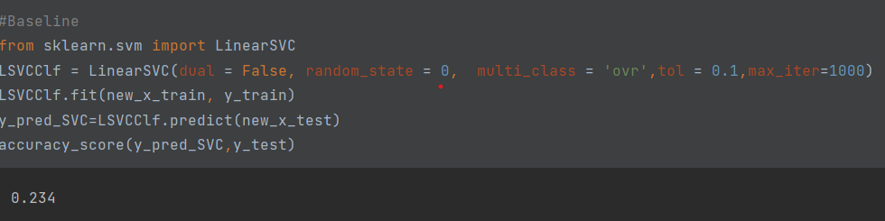
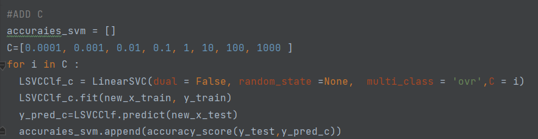
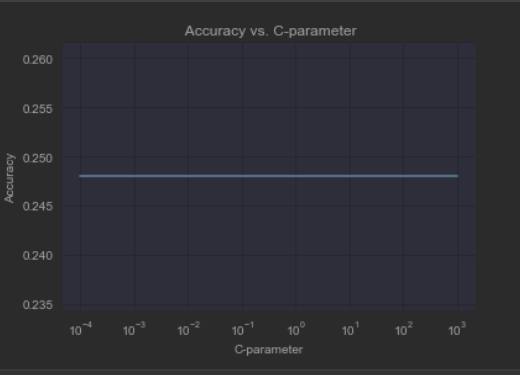

# Efficiency-Image-classification-on-Cifar-10-dataset
📖 Table of Contents

     1-➤ OverView
     2-➤ DataSet
     3-➤ Getting Started
          1- Classifier Models
             -KNN
             -Logistic Regression 
             -SVM
          2-  Evaluation the models

☁️ Overview
 This Project to know the basics of data loading and preparation  using Cifar10 dataset  implemented with different classification model 
 build KNN from Scratch   and try different modes of SVM and determine the best performance.

🔸   DataSet 

The CIFAR-10 dataset consists of 60000 32x32 colour images in 10 classes, with 6000 images per class. There are 50000 training images and 10000 test images.

The dataset is divided into five training batches and one test batch, each with 10000 images. The test batch contains exactly 1000 randomly-selected images from each class. The training batches contain the remaining images in random order, but some training batches may contain more images from one class than another. Between them, the training batches contain exactly 5000 images from each class.

📖  Getting Started
     
     Dataset Preparation 
 Download dataset from keras using :Data=tf.keras.datasets.cifar10.load_data()
 Split the data into train and test and validation 
  Visualize  five samples from each class

    ⚙️Models
 - knn

 using Euclidean distance  to measure th distance between every point 
 assume that k = [5,7,9,11]
  
 
Draw confusion  matrix and evaluate by accuracy score 

-Logistic Regression

 Using logistic regression from sklearn and build OvR from scratch  to achieve multi-class classfication 
 how to do this  by train a binary classifier   for each class  therefore  need 10 models 
 to   obtain the predicted class  by select the argmax
- SVM
 the goal  to compare different modes of the svm
* SVM baseline using linearSVC()
 
*  Scale dataset before adding Cost Parameter  with different range 
   
   - Plot the accuracy of C-parameter (which are  same )
   
* Add regularization term L1
*  Adding gamma with different range
